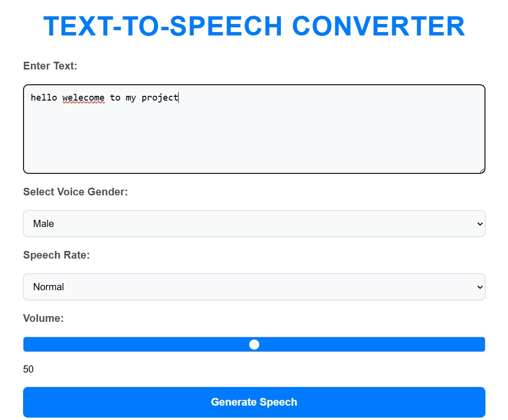

# Text-to-Speech Flask Application

A simple **Text-to-Speech** web application built with **Flask** and **gTTS (Google Text-to-Speech)**. The app allows users to input text, select voice gender, adjust speech rate, and volume, and then listen to or download the generated speech.

---

## Features:
- **Text-to-Speech Conversion**: Convert text input into speech using Google Text-to-Speech (gTTS).
- **Voice Gender Selection**: Choose between male and female voices.
- **Speech Rate**: Choose between normal or slow speech rates.
- **Volume Control**: Adjust the speech volume with a slider.
- **Responsive Design**: Fully responsive design for desktop and mobile devices.
- **Audio Playback**: Listen to the generated speech directly in the browser.

---

## Technologies Used:
- **Python**: Backend language.
- **Flask**: Python web framework for creating the application.
- **gTTS**: Google Text-to-Speech API to convert text to speech.
- **HTML, CSS, JavaScript**: Frontend for user interaction and design.
- **Bootstrap** (optional if used in styling): For responsive design and UI components.

---

## Screenshots:
  


---

## Installation Guide

To get this project running locally, follow the steps below.

### Prerequisites:
- **Python 3.x** installed on your system.
- **Pip**: Python package installer.

### Steps to Run the Application:

1. **Clone the Repository**:
    ```bash
    git clone https://github.com/your-username/text-to-speech-flask.git
    cd text-to-speech-flask
    ```

2. **Create a Virtual Environment** (optional but recommended):
    ```bash
    python3 -m venv venv
    ```

3. **Activate the Virtual Environment**:
    - On **Windows**:
      ```bash
      .\venv\Scripts\activate
      ```
    - On **macOS/Linux**:
      ```bash
      source venv/bin/activate
      ```

4. **Install Dependencies**:
    ```bash
    pip install -r requirements.txt
    ```

5. **Run the Application**:
    ```bash
    python app.py
    ```

6. **Access the Application**:
    - Open a browser and go to `http://127.0.0.1:5000/`.

---

## Usage

### Text-to-Speech Conversion:

1. **Enter Text**: Type or paste the text you want to convert into speech in the input box.
2. **Select Voice Gender**: Choose between a **Male** or **Female** voice.
3. **Select Speech Rate**: Choose between **Normal** or **Slow** speech rates.
4. **Adjust Volume**: Use the volume slider to adjust the output volume.
5. **Generate Speech**: Click on the "Generate Speech" button to convert your text into speech.
6. **Play Audio**: Once the audio is generated, click the play button to listen to the speech.

---

## Notes
Old audio files are automatically deleted after 30 seconds to save space on the server.

